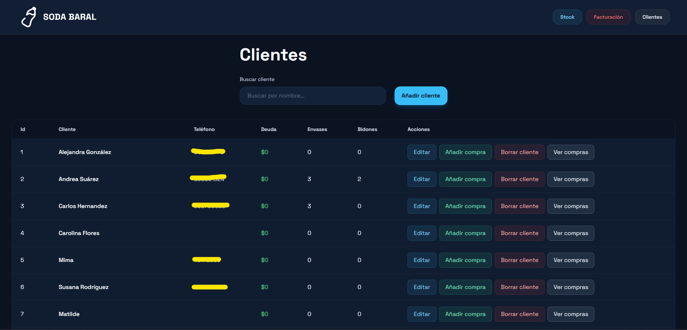
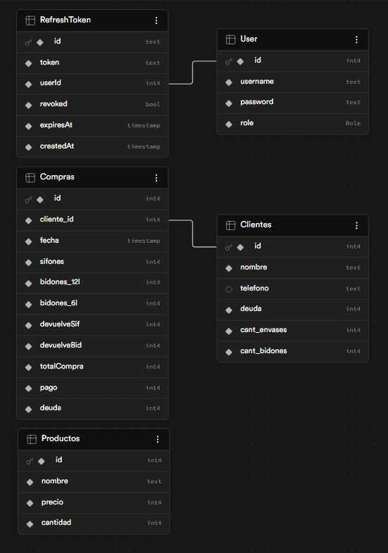
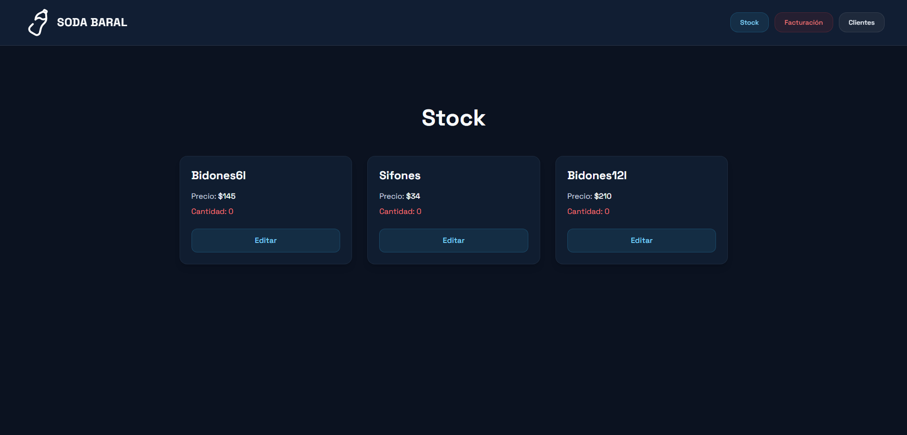
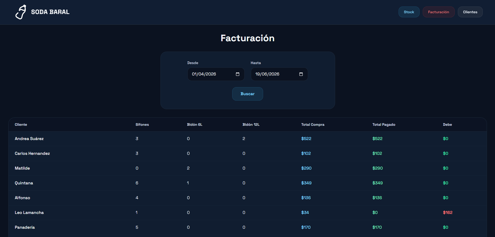
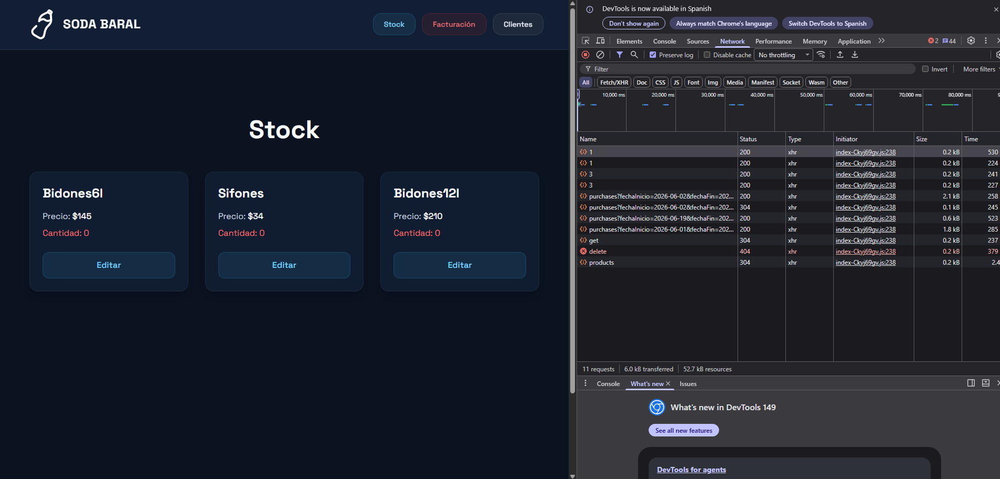
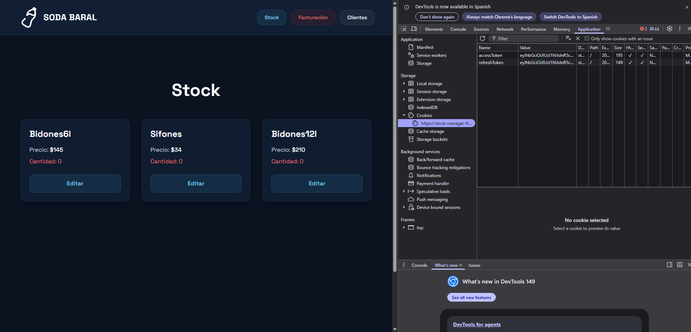

# StockManager - Soda Baral

This project is a business management tool used by staff to track sales and manage what each customer has purchased. It helps monitor client-specific products, keep sales records organized, and improve service by providing quick access to customer information.



## Characteristics

- ✅ JWT Authentication
- ✅ User Roles
- ✅ Responsive Design
- ✅ API REST
- ✅ PostgreSQL Database
- ✅ Deployment in Vercel + Render + Supabase
- ✅ Validations
- ✅ Docker
- ✅ Enchanced security, Rate Limiter + Cors + Helmet
- ✅ Logs with morgan
- ⌛ Tests

## Technologies

- TypeScript
- React
- TailwindCSS
- PostCSS
- Prettier
- EsLint
- Axios
- Docker
- PostgreSQL
- Prisma
- Express.js

## Architecture

```text
frontend/
├── src/
├── api
├── assets
├── components
├── pages
├── services
├── types
└── utils
backend/
├── src/
├── controllers
├── models
├── prisma
├── routes
├── services
└── utils
```

This project follows a layered architecture to separate responsibilities and make maintenance easier.

## Architecture diagram

React
↓
Express API
↓
Service Layer
↓
Prisma
↓
PostgreSQL

## Instalation

### Clone

git clone https://github.com/Jano2402/stockManager

### Configure

...

### Execute

...

The app will be available at:

http://localhost:????

## Live demo

Coming soon ...

## Enviroment Variables

Create a .env file in both the frontend and backend directories and set the corresponding variables based on the .env.template files.

## Project Journey and Preview

### Technical Decisions

#### Layered Architecture

The backend follows a layered architecture:

Controller → Service → Prisma

This separation allows business logic to remain independent from HTTP concerns and database implementation details, making the codebase easier to maintain and test.

#### Prisma ORM

Prisma was chosen over raw SQL queries to improve type safety and developer productivity while keeping database access consistent.

#### JWT Authentication

JWT authentication was selected to provide stateless authentication and simplify deployment across distributed environments.

#### Role-Based Authorization

Authorization is handled through user roles to restrict access to administrative operations and sensitive resources.

#### PostgreSQL

PostgreSQL was chosen because of its reliability, strong relational capabilities, and compatibility with Prisma.

#### Security Middleware

Helmet, CORS and Rate Limiting were added to mitigate common web vulnerabilities and abuse scenarios.

**Testing**

To be added ...

## Screenshots

### DB Structure



### Stock



### Billings



### Clients


### Request Examples



### JWT Example



**Future Improvements**

- Add tests
- Create a custom hook for Clients.tsx
- Add pagination to Clients.tsx
- Add profile page
- Add logout button
- Refetch data when something is modified
- Show who performed each action
- Add exit animations with Framer Motion
- Token rotation
- Logout with blacklist or token rotation invalidation
- Search bar on Facturación.tsx
- Locality filter

## Challenges

One of the main challenges was designing the billing system while keeping stock updates consistent.

Another challenge was implementing role-based authorization without coupling authorization logic to controllers.

The deployment process also required coordinating services across Vercel, Render and Supabase while maintaining environment configuration consistency. I had to create a proxy for JWT to not be blocked by the web browser due to cross-site requests.

## What I've learned

During this project I've deepended:

- Layered architecture
- Exception handling
- Security with JWT
- Good REST practices
- Deployment

## Author

Alejandro Martínez

Computer engineering student with interest in backend, software architecture and scalable sistem development.

LinkedIn:
https://linkedin.com/....

GitHub:
https://github.com/Jano2402/
